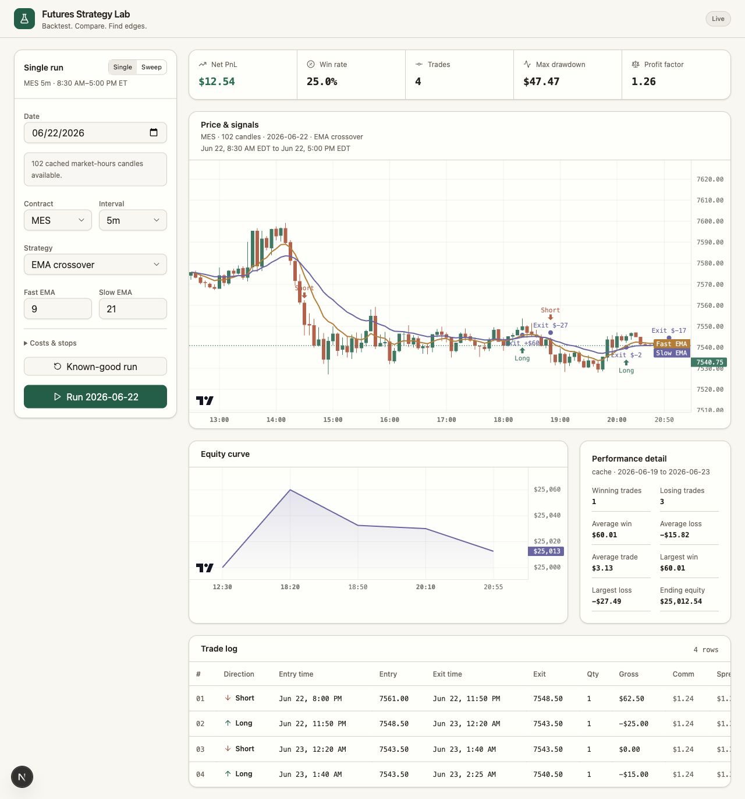
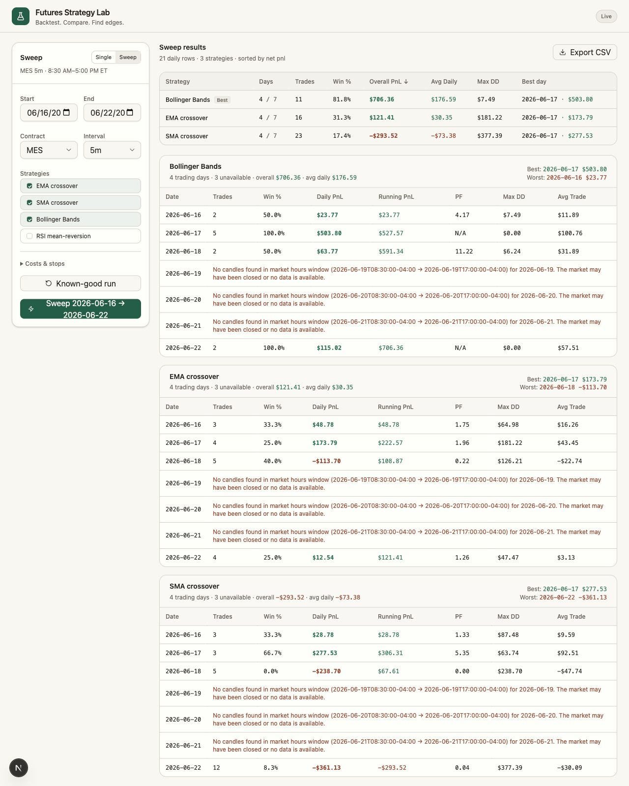

# Futures Strategy Lab

A local-first futures backtesting lab. Run cached MES/ES/MNQ/NQ sessions, compare simple strategies, and inspect fills, chart markers, realized equity, grouped sweeps, and performance metrics.

## Screenshots

### Single backtest



### Grouped strategy sweep



## Stack

- Next.js, TypeScript, Tailwind CSS, and shadcn/ui-style source components
- Lightweight Charts for candles, indicators, markers, and equity
- FastAPI, pandas, and numpy for validation and backtesting
- Local browser state only; no broker or database connections

## Project structure

```text
.
├── backend/
│   ├── app/
│   │   ├── backtest.py     # EMA signals, fills, PnL, metrics
│   │   ├── main.py         # FastAPI routes and CSV validation
│   │   └── models.py       # Typed strategy configuration
│   └── tests/
├── public/
│   └── sample-mes.csv
├── src/
│   ├── app/                # Next.js App Router entry and theme
│   ├── components/         # Dashboard, charts, trade table
│   │   └── ui/             # Owned shadcn/ui-style primitives
│   └── lib/                # Shared frontend types and utilities
└── package.json
```

## Run locally

Node.js 20.9+ and Python 3.11+ are recommended.

### One-command start

```bash
npm run dev:all
```

This starts FastAPI on [http://127.0.0.1:8001](http://127.0.0.1:8001) and Next.js on [http://localhost:3000](http://localhost:3000), with `NEXT_PUBLIC_API_URL` already pointed at the local API. Override ports with `API_PORT` and `NEXT_PORT`.

### Frontend only

```bash
npm install
npm run dev
```

Open [http://localhost:3000](http://localhost:3000).

When running the frontend by itself, set `NEXT_PUBLIC_API_URL` if your backend is not on the default `http://127.0.0.1:8000`. The included `.env.example` uses `http://127.0.0.1:8001` to avoid common local port conflicts.

### Backend only

In a second terminal:

```bash
cd backend
python3 -m venv .venv
source .venv/bin/activate
pip install -r requirements.txt
uvicorn app.main:app --host 127.0.0.1 --port 8001 --reload
```

The API runs at [http://127.0.0.1:8001](http://127.0.0.1:8001). To use another URL, set `NEXT_PUBLIC_API_URL` before starting Next.js.

## Deploy

The repo includes a Vercel-compatible FastAPI entrypoint at `api/index.py`, root Python dependencies in `requirements.txt`, and `vercel.json` rewrites for `/api/*`. In production the frontend calls same-origin API routes by default; locally `npm run dev:all` sets `NEXT_PUBLIC_API_URL` to the FastAPI dev server.

## CSV format

The upload must contain these case-insensitive columns:

```csv
timestamp,open,high,low,close,volume
2025-01-06T14:30:00.000Z,5030.00,5030.50,5029.50,5030.00,820
```

Timestamps are normalized to UTC. Rows are sorted and duplicate timestamps are removed. OHLC relationships, numeric values, non-negative volume, and minimum history length are validated before a run.

Use **Use sample CSV** in the app to load the included MES-like five-minute dataset.

## Workflow notes

- The sidebar remembers the last contract, interval, strategy parameters, costs, and stops in local browser storage.
- **Known-good run** resets the app to a cached MES 5m EMA setup so a tester can immediately verify the chart, metrics, and trade log.
- Sweep results can be sorted by table headers and exported to CSV.
- API responses are checked before rendering so unexpected backend shapes show a request error instead of breaking the charts.

## Backtest assumptions

- EMA crossovers are confirmed using the candle close.
- The backtest-day dropdown lists UTC calendar dates found in the uploaded file. Choose `All dates` to use the full file.
- Orders fill at the next candle open.
- A crossover reverses an existing position at that next open.
- Slippage is adverse on every entry and exit.
- Commission is entered per contract per side and charged twice per completed trade.
- Open positions are closed on the final candle close with the reason `End of data`.
- Max drawdown is the largest realized equity peak-to-trough decline in dollars.
- A profit factor with wins and no losses is returned as `N/A` in JSON/UI because JSON has no infinity value.

## Tests

```bash
cd backend
source .venv/bin/activate
pytest
```

Tests cover futures PnL and commission math, realized max drawdown, and EMA crossover detection.

Frontend checks:

```bash
npm run lint
npm run build
```

GitHub Actions runs frontend lint/build and backend tests on pushes and pull requests.

## API

`POST /api/backtest` accepts multipart form data:

- `file`: CSV upload
- `config`: JSON string containing strategy, contract, capital, cost, and EMA settings

`GET /health` returns a small readiness response.

`GET /api/available-dates` returns cached ET market-session dates that have enough candles to run a backtest. The frontend uses this to default to a known-good date instead of blindly selecting today.
